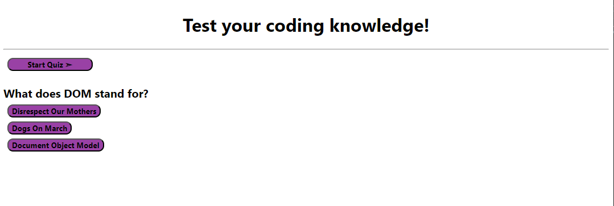

# Challenge-4

Coding Quiz

## Description

I wanted to create a quiz to test coding knowledge while tracking my score. I wanted to subtract 10 seconds from the time if the question was answered incorrectly.

## Usage

'''md

'''

## Link

https://daestanii1997.github.io/Coding-Quiz/